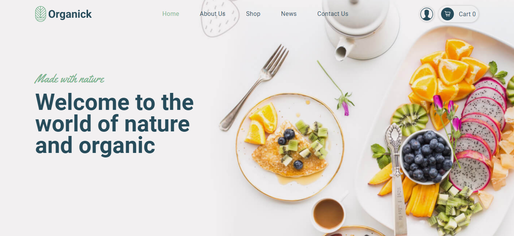
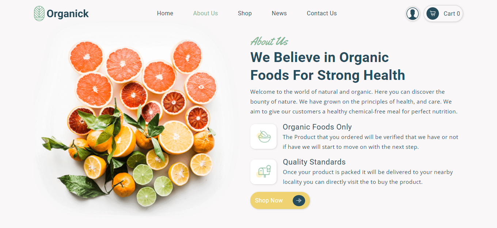
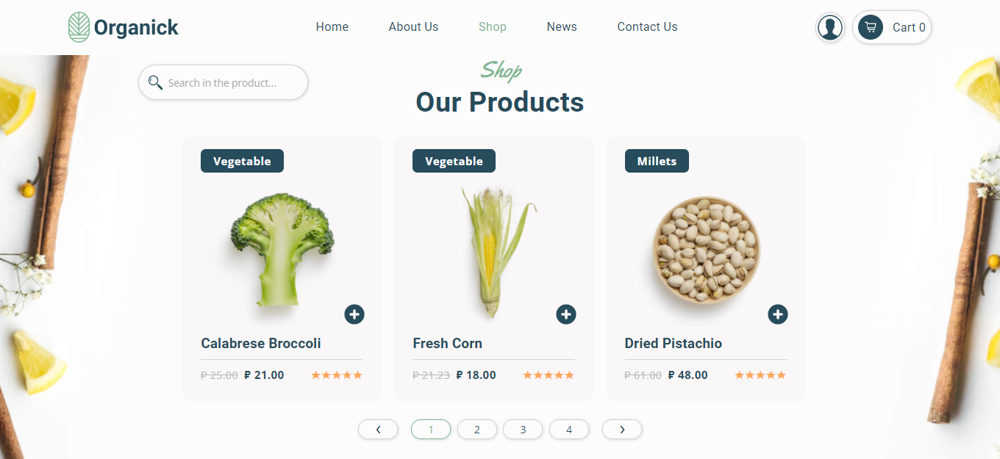
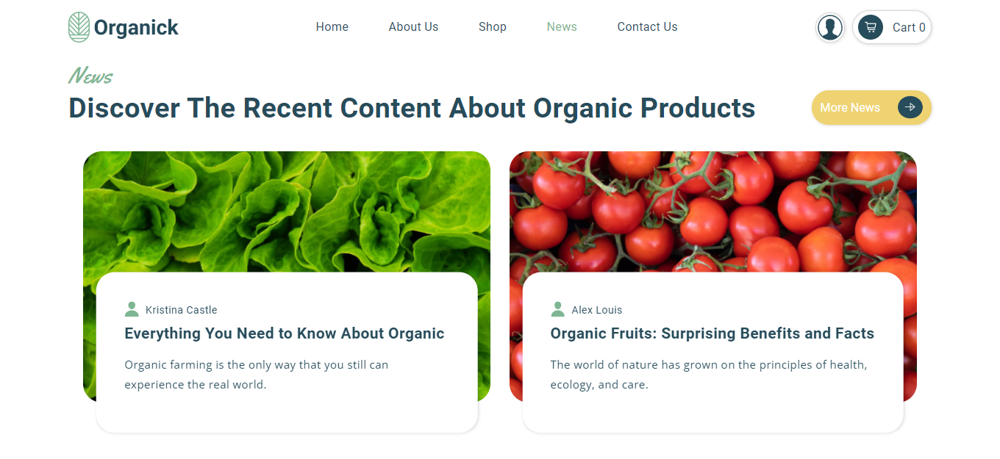
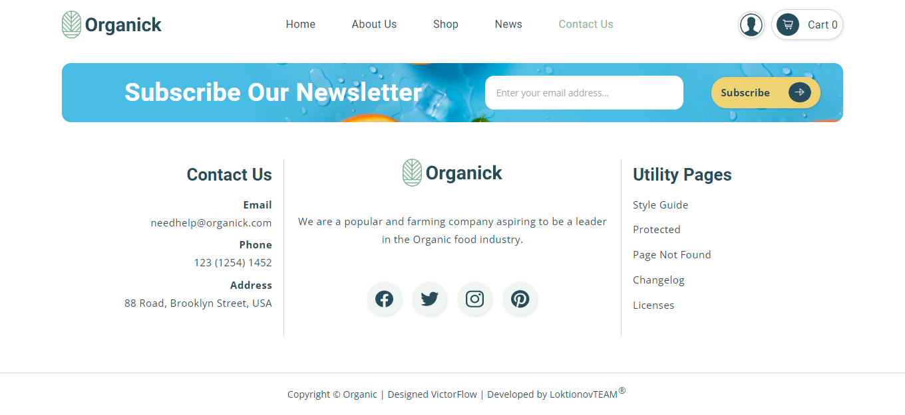
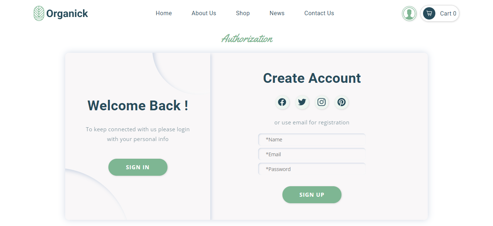
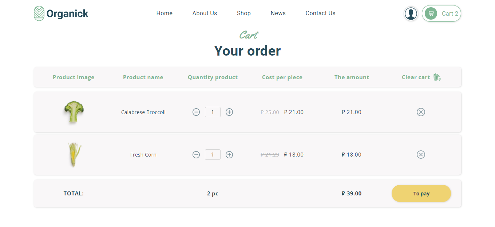
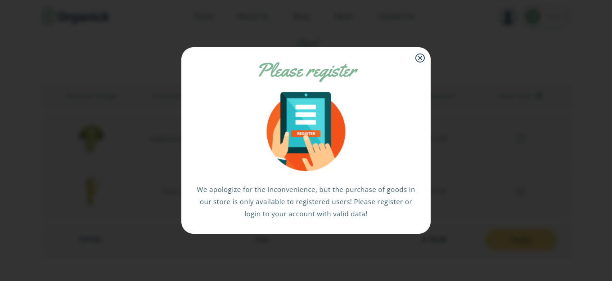

<h1 align="center" style="font-weight:bold;">
</h1>

<p align="center">
<a href="https://reactjs.org/"></a>
<a href="https://www.linkedin.com/in/loktionovteam/"></a>
<a href="https://mit-license.org/"></a>
<a href="https://github.com/LoktionovTEAM/Organick/archive/refs/heads/main.zip"></a>
</p>

<p align="center">мое первое React приложение с открытым исходным кодом, реализованное с использованием современных информационных технологий. В данном проекте вы втретите и адаптивную, кроссбраузерную и кроссплатформенную верстку, и создание форм и функциональных элементов приложения, и реализацию анимации и других динамических эффектов, и качественный, логичный, чистый, минимизированный и валидный код, а также интересные и неординарные технические и логические решения. </p>

</br>

## 🧰 **Инструменты**
| Ключевые инструменты, используемые в данном проекте:

| **Инструмент** | **Описание** |
| :--------------:|--------------|
| [**Figma**](https://www.figma.com/) | *онлайн-сервис, для разработки интерфейсов и прототипирования с возможностью организации совместной работы в режиме реального времени.* |
| [**VScode**](https://code.visualstudio.com/) | *легкий, но мощный редактор исходного кода, который работает на вашем рабочем столе и доступен для Windows, macOS и Linux.* |
| [**SASS**](http://sass-lang.com/) | *самый зрелый, стабильный, мощный и профессиональный язык CSS расширений в мире.* |
| [**Node**](https://nodejs.org/) | *программная платформа, основанная на движке V8, превращающая JavaScript из узкоспециализированного языка в язык общего назначения.* |
| [**React**](https://reactjs.org/) | *JavaScript библиотека, для уверенного создания пользовательских интерфейсов.* |
| [**Webpack**](https://webpack.js.org/) | *сборщик статических модулей для современных JavaScript приложений.* |
| [**Babel**](https://babeljs.io/) | *цепочка инструментов, используемая для преобразования кода ECMAScript 2015+ в обратно совместимую версию JavaScript в текущих и более старых браузерах или средах.* |
| [**Redux Toolkit**](https://redux-toolkit.js.org/) | *Redux библиотека, предназначенная для стандартного способа написания логики.* |
| [**Axios**](https://github.com/axios/axios) | *javaScript библиотека с открытым исходным кодом, построенная на HTTP-клиенте для браузера и Node.JS, основанном на Promise.* |
| [**JSON-server**](https://github.com/typicode/json-server) | *JavaScript библиотека для создания тестового REST API* |


</br>

## 💻 **Технологии**
| Основные технологии, используемые автором проекта:

| **Технология** | **Описание** |
| :--------------:|--------------|
| [**BEM methodology**](https://ru.bem.info/methodology/) | *компонентный подход к веб-разработке. Позволяет создавать расширяемые и повторно используемые компоненты интерфейса.* |

</br>

## 🧩 **Совместимость**
| [](http://godban.github.io/browsers-support-badges/)<br>Chrome | [](http://godban.github.io/browsers-support-badges/)<br>Firefox | [](http://godban.github.io/browsers-support-badges/)<br>Yandex | [](http://godban.github.io/browsers-support-badges/)<br>IE / Edge | [](http://godban.github.io/browsers-support-badges/)<br>Safari |
| --- | --- | --- | --- | --- |
| ✔️ last 5 versions | ✔️ last 5 versions | ✔️ last 5 versions | ✔️ IE11, ✔️ Edge | ✔️last 5 versions |

</br>

## 🏁 **Быстрый старт**
1. Клонируйте данный репозиторий, используя следующую команду в терминале: `git clone https://github.com/LoktionovTEAM/Organick.git`
2. Перейдите в соответствующий каталог с клонированным репозиторием: `cd Organick`.
3. Запустите `yarn` или `npm install` для автоматической установки необходимых пакетов зависимостей.
4. Запустите `yarn start` или `npm start` чтобы открыть приложение в браузере по URL адресу: `http://localhost:3000`
5. Поздравляю, только что вы развернули данное приложение у себя на клиенте. Приятного тестирования!

</br>

## 📸 **Скриншоты**
Home page
  

AboutUs page
  

Shop page
  

News page
  

ContactUs page
  

Authorization page
  

Cart page
  

Modal window
  

</br>

<!-- Видео демонстрация приложения -->
## ✨ **Демонстрация:** <a href="#">*смотреть*</a> 👀

</br>

<!-- Дополнительная информация -->
## 🧷 **Доподнительная информация**

| Вы можете использовать это програмное обеспечение в рамках лицензии `MIT`, по своему усмотрению, однако, согласно требованиям настоящей лицензии, указанное ниже уведомление об авторском праве и данные условия должны быть в обязательном порядке включены во все его копии или значимые части.


</br>

<!-- Автор проекта -->
## 🏆 **Автор проекта**
| [LoktionovTEAM<sup>®</sup>](https://github.com/LoktionovTEAM)

</br>

<!-- Ссылки на социальные сети -->
## 📮 **Связаться с автором проекта**
[][website]
[][youtube]
[][linkedin]
[][instagram]
[][vk]

[website]: https://github.com/LoktionovTEAM/
[youtube]: https://www.youtube.com/
[linkedin]: https://www.linkedin.com/in/loktionovteam/
[instagram]: https://www.instagram.com/
[vk]: https://vk.com/

</br>
</br>

<!-- Лицензия -->
## 🔓 **Лицензия**
```js
MIT License, Copyright © 2022 LoktionovTEAM
```
